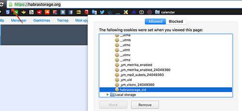

# Dev Tips Crawler

## How to crawl text
```
cd PROJECT_DIR
node download_posts.js SINCE_POST COUNT
```

* `SINCE` – 0-based number of a post to start with
* `COUNT` – count of posts to crawl

At the and of crawling you could find an html file named `SINCE-COUNT.html` at the `texts` folder.

## How to crawl images

```
cd PROJECT_DIR
node download_images.js SINCE_POST COUNT
```

* `SINCE` – 0-based number of a post to start with
* `COUNT` – count of posts to crawl

At the and of crawling you could find images in the `images` folder prefixed with the 1-based number of a post.

## How to upload images to habrastorage
Go to the habrastorage.org in Chrome and get the `habrastorage_sid` cookie.


Then launch the script:

```
cd PROJECT_DIR
ls images | xargs basename | xargs -I% ./upload_pic.sh HABRASTORAGE_ID `pwd`/images/% | node insert_images_link.js
```

You'll see each filename corresponding to an url to the uploaded picture.
